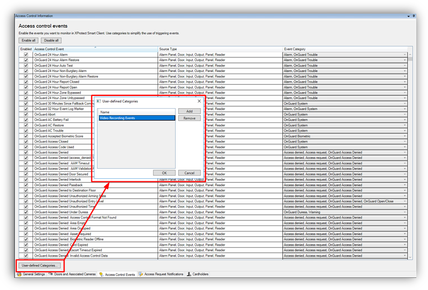
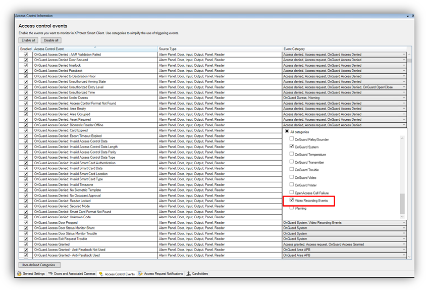

# Access control event categories

Below is the list of all access control event categories.

## Default XProtect Access events:

+ Access Granted
+ Access Request
+ Access Denied
+ Alarm
+ Error
+ Warning

## OnGuard events:

+ OnGuard Access Denied
+ OnGuard Access Granted
+ OnGuard Area ABP
+ OnGuard Asset
+ OnGuard Biometric
+ OnGuard Burglary
+ OnGuard C900
+ OnGuard Digitize
+ OnGuard Duress
+ OnGuard Fire 7
+ OnGuard Fire 8
+ OnGuard Fire 9
+ OnGuard Gas
+ OnGuard Generic
+ OnGuard Host Messages
+ OnGuard Intercom
+ OnGuard Medical
+ OnGuard Muster
+ OnGuard Open/Close
+ OnGuard Point of Sale
+ OnGuard Portable Programmer
+ OnGuard Relay/Sounder
+ OnGuard System
+ OnGuard Temperature
+ OnGuard Transmitter
+ OnGuard Trouble
+ OnGuard Video
+ OnGuard Water
+ OpenAccess Call Failure

## Custom events:

+ User Defined Category...

To create a user-defined category, there is a **User-defined Categories** button on the bottom left corner of the **Access control events** menu.

1. Click the **User-defined Categories** button to create your own custom event category. 
     
    {width=75%}
2. Click **Add**, name the category, and press **OK**. The user-defined category appears as an option in the **Event Category** list. 
     
    {width=75%}
