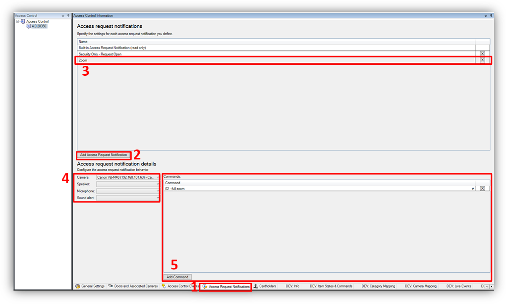
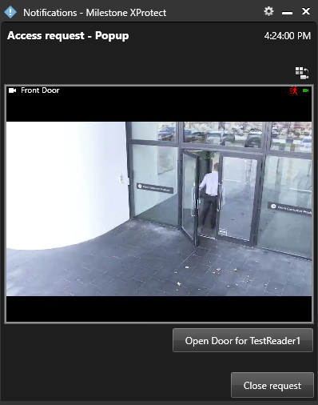

# Access request notifications 

Access request notifications are pop-up notifications which appear in front of all other desktop applications for all users logged into the Smart Client with privileges to view XProtect Access features and devices. The XProtect Access integration includes a built-in access request notification. Use the **Access Request Notifications** menu to customize these notifications.

1. Go to the **Access Request Notification** menu. 
2. Click the **Add Access Request Notification** button.
3. Name the new notification.
4. Associate cameras, speakers, microphones, and sounds.
5. Click the **Add Command** button and open the **Command** list to select which commands appear on the notification. 

!!! glass "Notification options"
    When the notification pops up on the desktop, a sound plays if you choose to include an audible notification. The built-in access request notification doesn't include a sound.

    Access request notifications can trigger pop up notifications from the XProtect rules system, and these notifications don't need to be related to access control hardware devices. 

    
