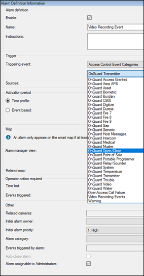
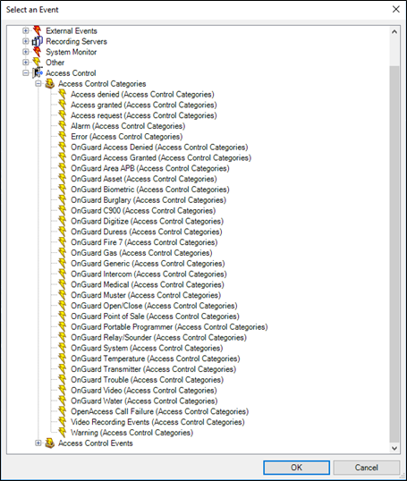

# Categorize events

Large scale access control systems, such as those managed by OnGuard, need to functionally integrate with XProtect without programming large numbers of individual alarms and rules. Categorizing access control events minimizes the number of individual alarms and rules requiring programming.

Categorize events to generate XProtect alarms or rule-based actions triggered by any OnGuard event from the chosen category. For example, the integration can start recording video based on any number of unique OnGuard hardware events: “Door Forced,” “Denied, Badge Not in Panel,” and “Access Denied Unauthorized Entry Level.” Categorize the events, then create a rule to start recording based on events from that category.

1. Go to the **Access Control Events** tab of the XProtect Access instance in the Management Client.
2. Select an event, and choose a category from the **Event Category** list.
3. Apply the same category to any number of events.
4. When creating rules and alarms within XProtect, if you choose an **Access Control Category** as the trigger, any of the events that are in the chosen category cause the rule or alarm to happen.
5. **Alarms** and **Rules** in XProtect can trigger using any category of event.
    + Alarm **Access Control Event Categories** list: 
        
    + Rule **Access Control Categories** event list: 
        