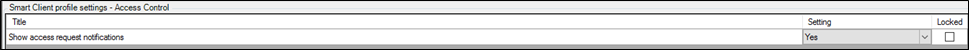
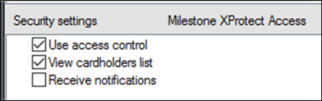

# Managing client profiles & Roles

1. To manage Smart Client profiles:
    + Open the Management Client.
    + Expand **Client** and select **Smart Client profiles**.
    + The **Access Control** menu has the setting for notifications. 
        
2. To manage user roles:
    + Open the Management Client.
    + Expand **Security** and select **Roles**.
    + Select the role to manage and click the **Access Control** menu to adjust the available settings. 
        

!!! glass "Receive notifications"
    The **Receive notifications** setting only applies to the XProtect mobile client.
