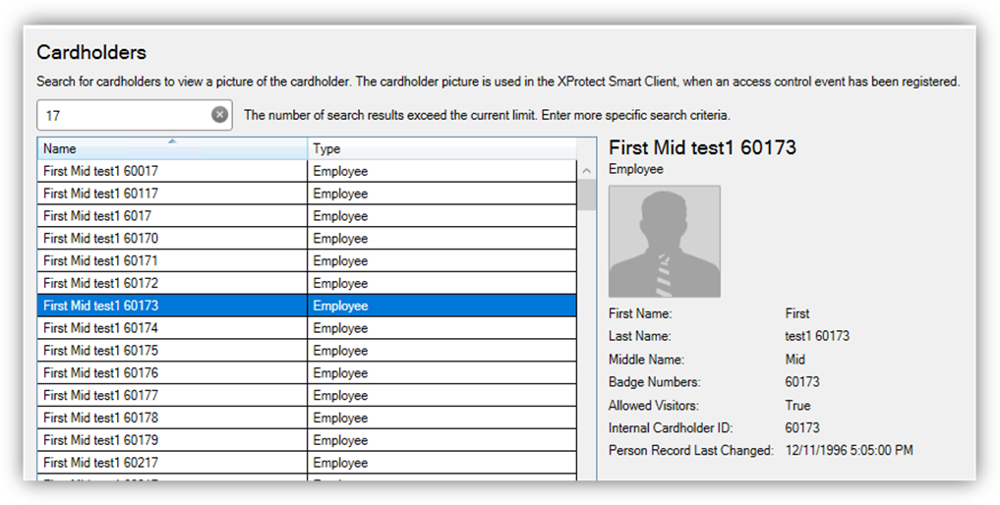

# Searching for cardholders explained

All active cardholders in the OnGuard system are imported to the integration. Active cardholders have one or more badge(s) with a status of “active.” Search for cardholders in the **Cardholders** menu of the XProtect Access instance. First Name, Last Name, Badge Numbers, and Cardholder ID are all included in the search. As characters are typed in the box, searching begins: 

{width=75%}

Visibility of cardholder information, such as name and badge numbers, comes from the OnGuard database.

!!! glass "Modify cardholder data"
    Edit the **PluginSettings.json** configuration file to change the data available within each cardholder record, and change the order of data display. To learn more read: [Cardholder search data fields are missing, or out of order](/Troubleshooting/CardholderModify/)