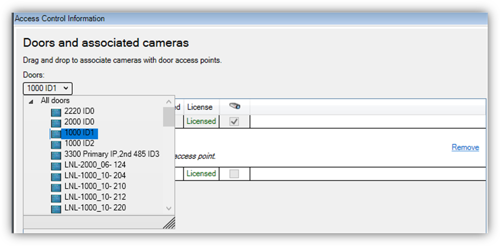
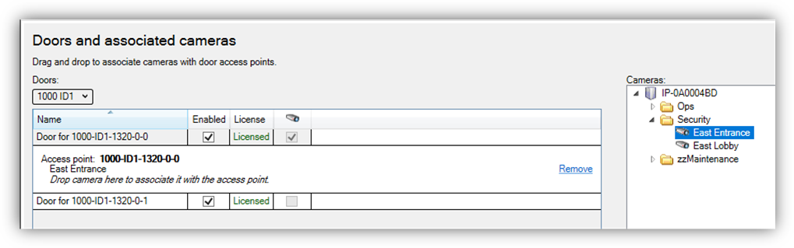

# Door & camera association

In the **Doors and Associated Cameras** menu of the XProtect Access Instance it's possible to verify the status of all connected doors, and create, reassign, and remove the association between cameras and doors. Doors require associated cameras to view live and recorded video - and listen to or play audio through any XProtect client that supports visualization of doors.

1. Open the doors list and select a panel to view all doors connected to that panel.

2. Select a door. A list of all associated cameras appears under the door object.
3. Select a camera from the **Cameras** list on the right and drag the selected camera into the list of cameras associated to the chosen door.

4. Click the **Remove** link if you need to end the association between the camera and the door.