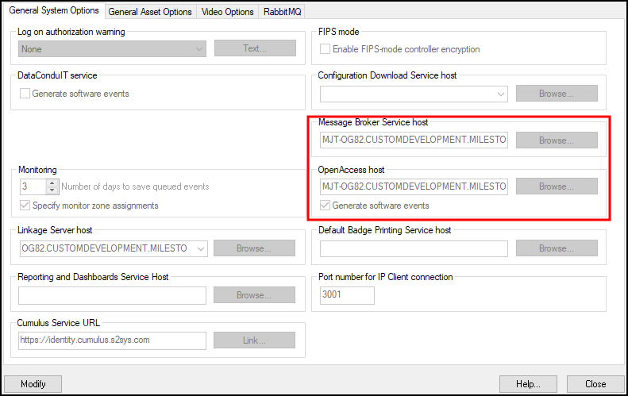
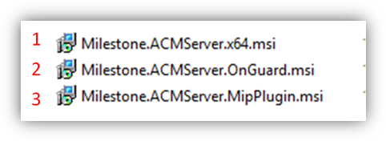

# Upgrading from DataConduIT

Any XProtect Access integration using the DataConduIT connection mode can't upgrade directly to versions 4.0 or newer. DataConduIT is only compatible with XProtect Access versions 3.4 or older. All systems running DataConduIT must enable OpenAccess, upgrade to version 3.6 of the integration, and then upgrade to the most recent version. Perform the following procedure to upgrade.

1. Apply the OpenAccess license.
    + Contact CARRIER to enable the OpenAccess Integration license (ITM-MLST-001) and the Partner Integration license (IPC-311-MLST01).
    + Once you have the OpenAccess license, go to the **License Administration** app on the OnGuard server. Go to **Start > All Programs > OnGuard (X.X)**, select **License Administration** and then log in.
    + On the left side of the web interface select **Install new license**.
    + Upload the new license file to enable the OpenAccess features.
2. Verify that OpenAccess configuration in OnGuard.
    + Go to **Start > All Programs > OnGuard (X.X)**, select **System Administration**.
    + In the System Administration client, go to the **Administration** menu and select **System Options**.
    + Identify the host(s) running the **Message Broker Service** and **OpenAccess** services: 
         
        {width=60%}
    + On the host(s), confirm that the following services are all running: 

        | OnGuard Service Name  | Known Good Service Locations  |
        |-----------------------|-------------------------------|
        | LS Message Broker     | On the identified host        |
        | LS OpenAccess         | On the identified host        |
        | LS Web Service        | By default LS Web Service runs on the same host as the LS OpenAccess service. |
        | LS Event Context Provider | Must run on the same host as the LS OpenAccess service    |
        |LS Web Event Bridge    | By default LS Web Event Bridge runs on the same host as the LS OpenAccess service.    |
      
3. Verify prerequisites installed to support the 3.6 version of the OnGuard XProtect Access plug-in.
    + Each downloadable .ZIP file available at download.milestonesys.com/lenels2xpa has a prerequisites folder containing any required installation programs.
4. Upgrade your OnGuard XProtect Access Plugin to Version 3.6.
    + Always upgrade the ACM Server and the OnGuard ACM plugin on the OnGuard machine before upgrading the XProtect Event Server ACM MIP plugin.
    + On the OnGuard Server, first install the Milestone ACM Server.
    + Second, install the Milestone ACM Server: OnGuard Plugin.
    + Lastly, move to the XProtect Event Server and install the XProtect Event Server ACM MIP Plugin.
    + Here is the order of installation for all three software components of the plug-in: 
         
    + Refresh the configuration on the OnGuard XProtect Access instance in the Management Client.
    + Now, the active OnGuard XProtect Access instance is using OpenAccess connection mode, and running version 3.6.
    + An upgrade directly to version 4.3 is supported.
5. Verify the prerequisites are in place to support version 4.3.
6. On the OnGuard Server first install the OnGuard XProtect Access Service.
7. Next move to the XProtect Event Server and install the OnGuard XProtect Access MipPlugin.
8. Refresh the configuration on the OnGuard XProtect Access instance in the Management Client and reconfigure the connection properties in the **General Settings** tab as required.
9. Reconfigure any rules triggered by access control events or event categories. Read: [Access control rules stop working after upgrade to 4.0 or newer](/Troubleshooting/RulesStopWorking/).