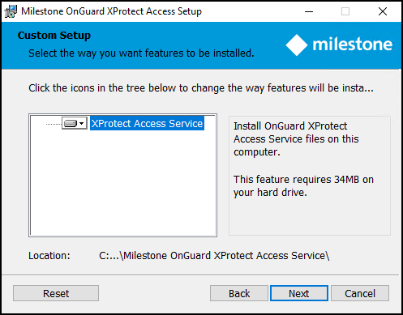

# Step 1: Installing OnGuard XProtect Access Service

1. Double-click the XProtectAccess.OnGuard.msi file to begin.
2. The installation wizard launches. Click **Next** to continue. 
    
3. The context sensitive wizard offers to install the required components for the OnGuard XProtect Access Service. Click **Next** to continue. 
    
4. Optionally, expand the server icon menu to view installation options. The **Reset** button returns the wizard to all default options. 
    
5. Choose the account used to run the OnGuard XProtect Access Service. The wizard selects the **LocalSystem** account by default. Click **Next**. 
    
6. The ready to install step confirms the wizard can begin installation. Click **Install**. 
    
7. Installation is complete. Click **Finish**. 
    