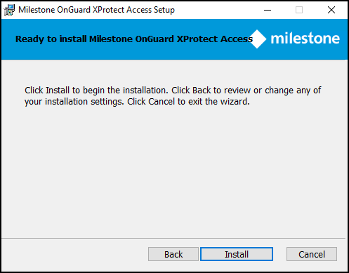
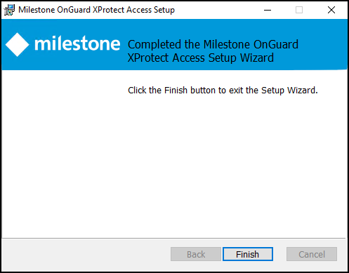

# Step 2: Installing OnGuard XProtect Access MipPlugin

1. Place the XProtectAccess.OnGuard.msi file on the server hosting the XProtect Event Server (in a typical deployment, this is the Milestone XProtect Management Server), and double-click the file to begin.
2. After the opening step, the context sensitive installation wizard offers the option to install the OnGuard XProtect Access MipPlugin. Click **Next** to continue. 
    
3. Optionally, expand the server icon menu to view installation options. The **Reset** button returns the wizard to all default options. 
    
4. The ready to install step confirms the wizard can begin installation. Click **Install**. 
    
5. You have installed the OnGuard XProtect Access MipPlugin. Click **Finish**. 
    