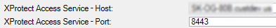

# Integration version upgrades

All components are updated with every new OnGuard XProtect Access release. The installation program is designed to automatically remove and replace the required files and folders during an upgrade from older versions of the integration.

## Upgrade process:

The process for upgrading can follow any order. However, the recommended order is as follows:

1. Go to the OnGuard server(s) - All OnGuard machines where the ACM Server is installed.
2. Run the XProtectAccess.OnGuard.msi installation program. It performs the following actions:
    + Uninstall the ACM Server OnGuard Plugin
    + Uninstall the ACM Server
    + Install the OnGuard XProtect Access Service.
3. Go to the XProtect server(s) Milestone XProtect Event Server hosts where the Mip Plugin is installed.
4. Run the XProtectAccess.OnGuard.msi installation program. It performs the following actions:
    + Uninstall the Mip Plugin and the ACM Wizard
    + Remove the folder created by the ACM Wizard for OnGuard at the default location (C:\Program Files\Milestone\MipPlugins\OnGuardACMServer)
    + Install the OnGuard XProtect Access MipPlugin and create a new folder at the default location (C:\Program Files\Milestone\MipPlugins)

Automatic upgrades of configured and installed instances in the Management Client are supported for all versions of the OnGuard XProtect Access integration. Run the XProtectAccess.OnGuard.msi installer; it upgrades any installed components. The system should be up and running, fully functional, after the upgrade.

## Upgrading from 4.0 or older?

Versions 4.1 and higher of the integration add two fields to the **General Settings** menu in the Management Client to define the connection between the OnGuard XProtect Access MipPlugin (on the XProtect server) and the OnGuard XProtect Access Service. These are **XProtect Access Server - Host:** and **XProtect Access Server - Port:** 

The upgrade process fills the Port field with the default value of 8443, but the Host field remains empty. Before saving any changes in the Management Client the host value is required. During the upgrade, the configuration value for the host field is retained from the old version of the integration from the "connection profile" setting. This is why the integration continues to function. However, once it's opened, the UI logic of the Management Client requires this field to be populated and saved accurately.

1. Open the XProtect Management Client.
2. In the **General Settings** tab of the upgraded OnGuard XProtect Access instance, enter the hostname for the OnGuard server or the Integration Server in the **XProtect Access Service - Host:** field.
3. Save the changes in the Management Client.

??? abstract "Rules stop working after upgrade?"
    Upgrading to 4.0 or higher from older versions requires reconfiguration of all rules in XProtect triggered by access control events or event categories. Door hardware objects aren't supported as event sources in 4.0 or newer versions, readers are used instead. Read more here: Access control rules stop working after upgrade to 4.0 or newer.