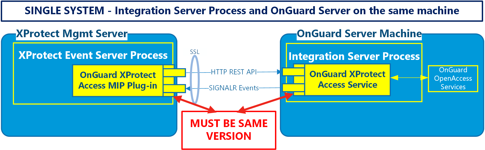
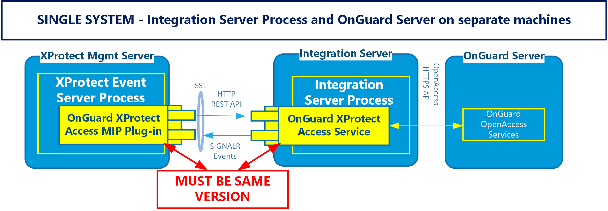

---
hide:
  - navigation
---
# Installation program (explained)

The installation package consists of one context sensitive installer program:

+ XProtectAccess.OnGuard.msi

This program detects which server it's running on (OnGuard or XProtect), and installs the following software components:

1. OnGuard XProtect Access Service - installed on the OnGuard server, or its own integration server.
2. OnGuard XProtect Access MipPlugin - installed on teh XProtect Event Server host machine or on a standalone Milestone XProtect Management Server. 

Or

??? success "Plugin version requirements"
    >
    >   It's required that the exact same versions of the OnGuard XProtect Access integration software components are installed on both the OnGuard and XProtect machines.
    >
