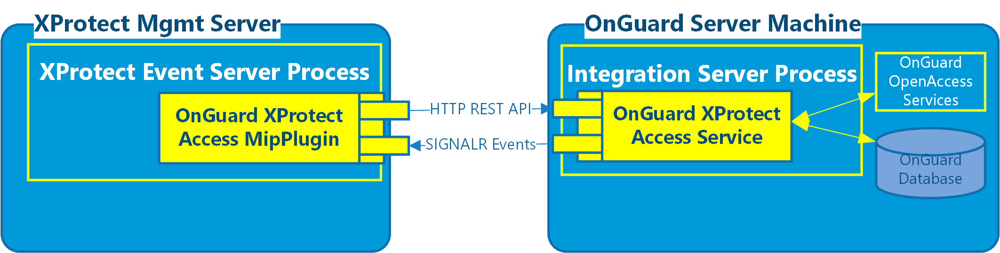

# Solution overview

The solution provided has two components:

1. OnGuard XProtect Access Service - Typically installed in the OnGuard environment.
2. OnGuard XProtect Access MipPlugin - Installed in the XProtect environment.

