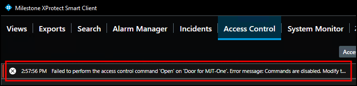

# Commands explained

Commands in the XProtect Access OnGuard integration interact with access control devices. By default, commands are disabled in the plugin configuration. This can be changed in the XProtect Management Client by clearing the Options - Disable Commands checkbox.

If commands are turned off, none of the command features work, however it's still possible to view command buttons in the Smart Client and create rules in XProtect which use commands. These rules validate, and the buttons appear, but nothing happens. In the Smart Client users receive the following error message:

```HH:MM:SS AM/PM Failed to perform the access control command ‘**COMMAND**’ on ‘**DEVICE**’. Error Message: Commands are disabled. Modify the plugin configuration in the XProtect Management Client to enable commands.```



Commands are used to trigger state changes in the access control hardware devices. Commands trigger in four ways with the XProtect Access OnGuard integration: 

1. The XProtect rules system can trigger commands.
2. Access request notifications can include commands.
3. Any location in the Smart Client where doors are visualized, such as the access monitor or the access control workspace, can contain command buttons.
4. The map interface within the XProtect Smart Client can include access control device icons which can be used to trigger commands.