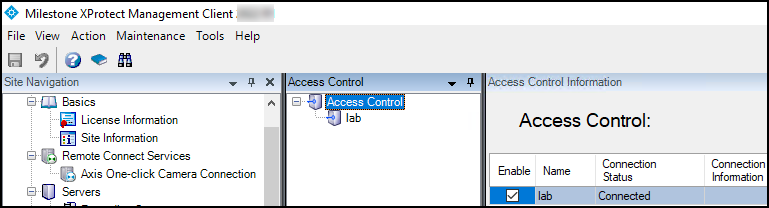
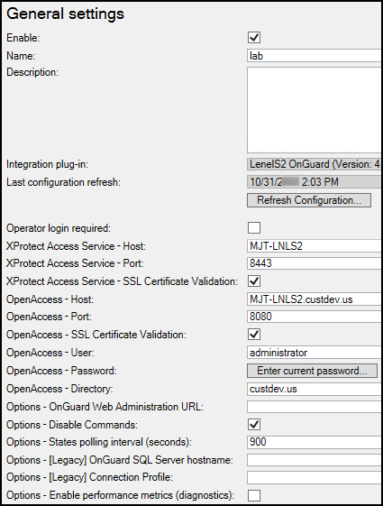
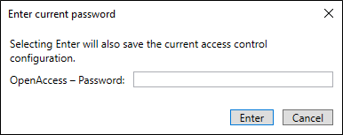

# XProtect Access instance status & properties

Go to the Access Control menu in the directory tree of the XProtect Management Client. You can view status of all instances by selecting the root of the Access Control directory. 

Select your OnGuard XProtect Access instance to view or edit the properties of the connection. 

Descriptions for all properties listed below:

|Property Name  | Description - Purpose |
|---------------|-----------------------|
| Enable:       | Selected by default. Remain selected to keep connection properties active.    |
| Name:       | Custom name field.    |
| Description:       | 	Reference information field.    |
| Integration plug-in:       | Displays the current version of the OnGuard XProtect Access MipPlugin.    |
| Last configuration refresh:      | Displays the date and time of the last system configuration refresh.    |
| Operator login required:       | Not selected by default. Select this option to enable the personalized login feature.    |
| XProtect Access Service - Host:       | Host name of the OnGuard server or the Integration Server hosting the OnGuard XProtect Access Service.    |
| XProtect Access Service - Port:      | 8443 is the default port.    |
| XProtect Access Service - SSL Certificate Validation       | Not selected by default. Choose this option to secure communication between the OnGuard XProtect Access Service and the XProtect Event Server.    |
| OpenAccess – Host:       | IP address of the machine hosting the OnGuard OpenAccess service in non-encrypted scenarios. This field must use fully qualified domain name (FQDN) of the server to support SSL authentication. See the note below for scenarios where the OpenAccess service and the XProtect Access Service are installed on the same server.    |
| OpenAccess – Port:       | The port the OnGuard OpenAccess service is listening on. 8080 is the default port.    |
| OpenAccess - SSL Certificate Validation       | Not selected by default. Choose this option to secure communication between the OnGuard XProtect Access Service and the OnGuard OpenAccess Service.    |
| OpenAccess – User:       | An OnGuard administrative user to log into the OnGuard OpenAccess web service. This user should have access to all hardware, cardholders, etc in the system. Windows user account if using Directory users, OnGuard internal user account if using internal directory.    |
| OpenAccess – Password:       | The password of an OnGuard user to log into the OnGuard OpenAccess web service. In XProtect versions 2021 R1 and newer, after entering the password, this field is replaced by the **Enter current password…** button in the **General Settings** tab. If the SSO user account is changed to update the integrated hardware device set, or the current user’s password needs updating - click the button to open a dialog box.     |
| OpenAccess – Directory:       | The name of the OnGuard directory used for logging into the OnGuard OpenAccess web service. If left blank, the OnGuard internal directory is used.    |
| Options – OnGuard Web Administration URL:       | A URL for the OnGuard web-based administration portal. This field creates a link to the portal from the Smart Client **Access Control** workspace. By default the location for this URL is: https://HostName:8080/#/Login - Where "HostName" is the hostname of the OnGuard server.    |
| Options – Disable Commands:      | Selected by default. This option controls all command interaction between XProtect and OnGuard access control hardware devices.    |
| Options – States polling interval (seconds):       | Default value is 900 seconds. Frequency of status updates retrieved for AC hardware devices. Increase this value for more consistent event processing throughput.    |
| Options – '[Legacy]' OnGuard SQL Server hostname:       | SQL server hostname in systems upgraded from 3.X versions to the current 4.X version which doesn't require a SQL server hostname to establish the connection.    |
| Options – [Legacy] Connection Profile:      | This value is automatically filled for systems upgrading to 4.1 or newer versions of the integration from a 4.0 or older version.    |
| Options - Enable performance metrics (diagnostics):      | Not selected by default. Select this option to include performance statistic logging on event metadata.    |

You can verify that the integration module is now connected by looking at the access control tree.

??? warning "Trouble connecting using encrypted communication"
    In scenarios where the OpenAccess service and the XProtect Access Service are located on the same server, the **OpenAccess - Host** field must contain the PC name of the server where the OpenAccess service is installed in order to use SSL encryption between the OpenAccess service and the Event Server. In these scenarios the process used to create the certificate specifies the PC name, and any other method of identification for the server - such as the IP address or the fully qualified domain name - will not work. Make sure to match the PC name with the data entered in the **OpenAccess - Host** field.