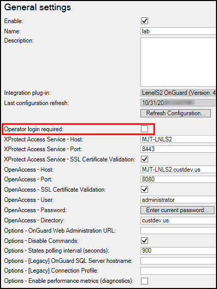

# Enabling or disabling personalized login

Enable or disable personalized login for a specific access control plug-in in the Management Client. The option is located in the general settings menu and is titled **Operator login required:**

After choosing to enable or disable this feature, make sure to save your changes in the Management Client.