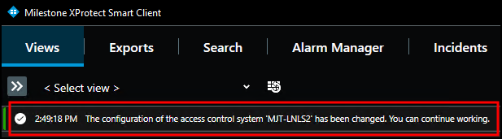
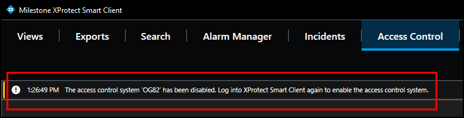

# Refreshing personalized login

The XProtect Event Server stores personalized configurations for XProtect Smart Client users. Stored personalized configurations vanish when the Event Server restarts. When the global configuration of the XProtect Access instance refreshes, the Event Server updates all stored personalized configurations. Changes to this configuration can cause error messages for users logged into the Smart Client. Below, are two possible error messages, known causes, and how to fix them.

!!! glass "Smart Client system configuration error messages"
    After the global configuration updates, all open Smart Clients using a personalized configuration display the following info message. 
    
     
    Log out of the Smart Client and log back in using the personalized configuration to load the updated configuration.

!!! glass "Smart Client OnGuard disconnect error messages"
    The following error message that the system has been disabled can result from a modified OnGuard segment configuration for the current logged in operator. 
    
     
    Log out of the Smart Client and log back in to restore integrated access control system functionality.