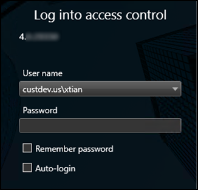

# Logging into Smart Client with personalized login

After you launch the Smart Client and login, the personalized login feature presents a second login dialog for OnGuard.

OnGuard requires three pieces of data during this exchange:

1. directory
2. user name
3. password

The XProtect Smart Client dialog has fields for user name and password. Enter the directory with the user name in this format:

+ DirectoryName\UserName

??? abstract "How to connect without a directory"
    If no directory is provided, the OnGuard internal directory is used. OnGuard can use special non-alphanumeric characters, control characters, and spaces in directory names. Use of these characters isn't compatible with XProtect. If these types of characters are included in the OnGuard directory, authentication fails.

After entering the directory\user name and password, the XProtect Smart Client validates the credentials with the OnGuard system. If you click Skip this step, the Smart Client opens without using personalized login, and no XProtect Access features are available in the Smart Client. After authentication with OnGuard, Smart Client loads a personalized configuration. The Smart Client displays access control information from the user account that logged in during the personalized configuration login dialog. This includes:

+ Alarms related to hardware the user has privileges to view
+ Events related to hardware the user has privileges to view
+ Devices in the map element selector that the user has privileges to view