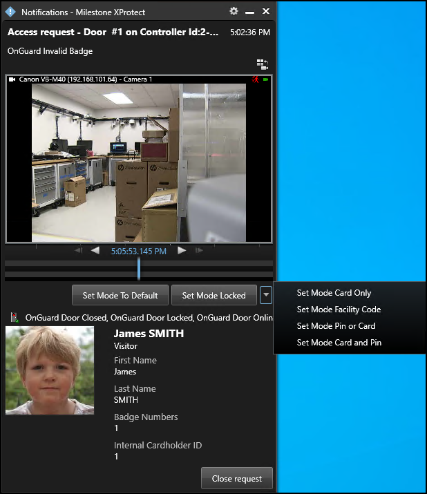
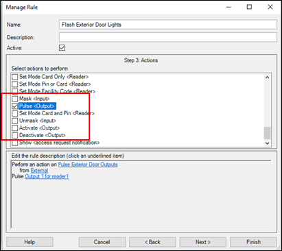
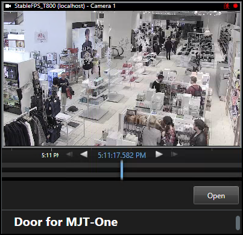

# Supported commands reference

The following are the devices and their supported commands.

## Readers:

+ Set Mode To Default
+ Set Mode Locked
+ Set Mode Unlocked
+ Set Mode Card Only
+ Set Mode Pin or Card
+ Set Mode Card and Pin
+ Set mode Facility Code

!!! glass "Set Mode"
    **Set Mode** commands for readers change the authentication mode the reader responds to. For example: a rule can switch readers into unlocked mode during business hours.

## Reader Inputs:

+ Mask
+ Unmask

## Reader Outputs:

+ Activate
+ Deactivate
+ Pulse

!!! glass "Inputs & Outputs"
    Reader inputs have a state of masked or unmasked. A masked input doesn't report or save status in the OnGuard system. The masked input also has a "mask" icon attached to its own icon on the Smart Client map. Unmask enables status of that input to be reported and saved within OnGuard, and removes the mask icon. Reader outputs are activated, de-activated, and pulsed using the respective commands. The **Pulse** command activates the output temporarily, then deactivates it. An activated output has a red circle icon attached to it when viewed on the Smart Client map.

## Doors:

+ Open

!!! glass "Door status animations"
    Doors are opened via the command. When the door opens, the door icon animation displays this status on the Smart Client map. 
    
