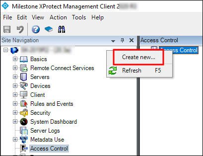
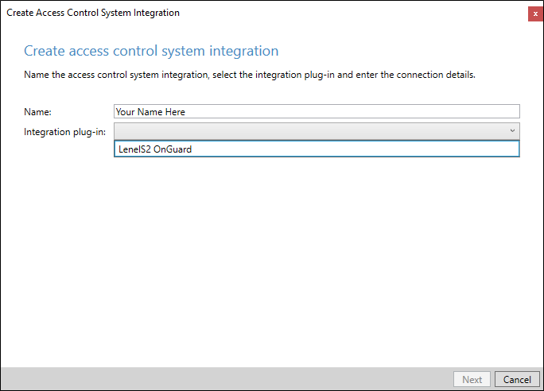
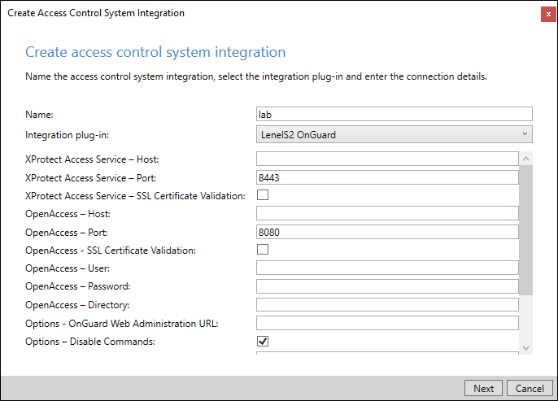
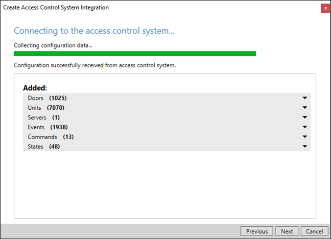
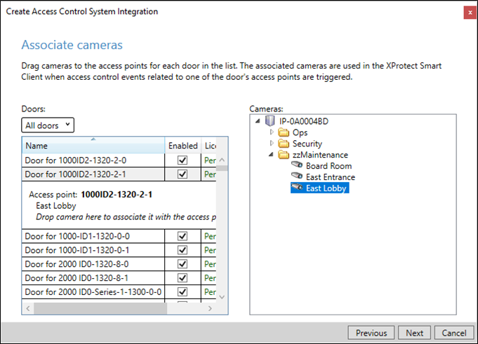

---
hide:
  - toc
---
# XProtect Access instance creation wizard

After installing the OnGuard XProtect Access MipPlugin on the XProtect Event Server, create the access control instance in the XProtect Management Client.

1. Right-click the **Access Control** root node and select **Create new...** to begin the wizard.

2. Enter a name for the instance and select the **Integration plug-in**. Select the plug-in named **LenelS2 OnGuard**.

3. After naming and selecting the plug-in there are a set of required credentials, parameters, and options to complete. These fields define the connection to the OnGuard server. All properties for all supported versions of OnGuard are in the Management Client wizard.
>
>   
>   + Below are the fields required to establish the connection. It's possible to populate any field at this step in the process, the fields listed are the minimum required.
>
|Empty Field Names                  | Required Values                                           |
|-----------------------------------|-----------------------------------------------------------|
| XProtect Access Service - Host:   | Hostname of the OnGuard server or the Integration server. |
| XProtect Access Service - Port:   | Default port is 8443.                                     |
| OpenAccess - Host:                | IP address for the OnGuard server.                        |
| OpenAccess - Port:                | Default port is 8080.                                     |
| OpenAccess - User:                | SSO user defined in OnGuard                               |
| OpenAccess - Password:            | Password for the SSO user in OnGuard.                     |
| OpenAccess - Directory:           | Directory for the SSO user in OnGuard.                    |
4. After connection, the wizard imports data from the OnGuard server. This includes **Doors**, **Units**, **Servers**, **Events**, **Commands**, and **States**. Click **Next**. 

5. Associate doors with cameras. Select a camera and drag it to a door.

6. Click **Next** after association of doors and cameras.
7. The configuration is saved, and the wizard ends.

