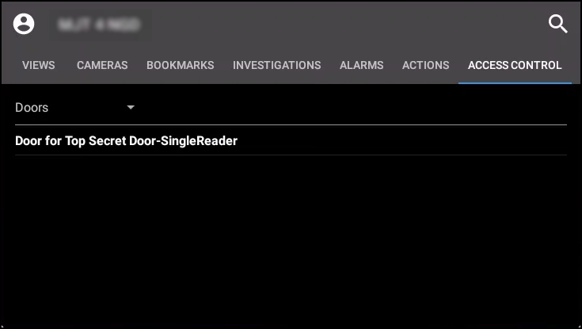
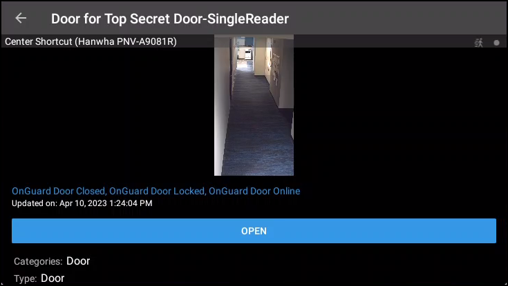
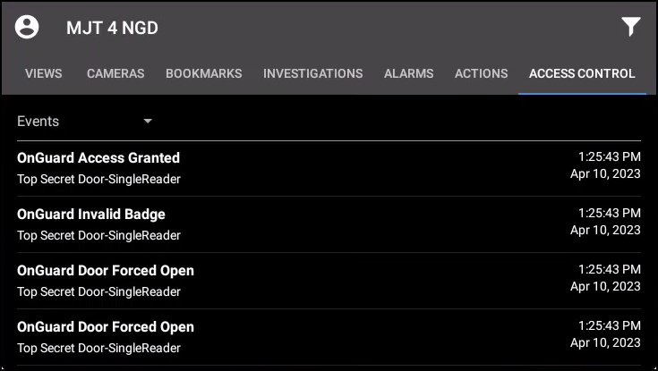
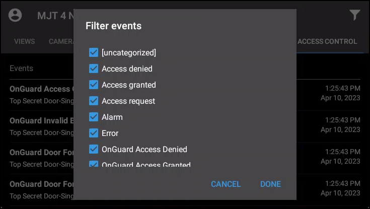

# Using the access control tab in XProtect Mobile

1. Log into the VMS with XProtect Mobile. By default the **Views** tab appears.
2. Select the **Access Control** tab. The **Access Control** tab shows the list of doors available. 
    
3. Filter for specific doors or select a door to view cameras associated to that door or interact with commands available for the selected door. 
    
4. Swipe to switch between cameras when more than one camera is associated to the door.
5. Switch between **Doors**, **Events**, and **Access Requests**.
6. Select an event from the event list to view still images associated to the event and playback video related to the event. 
    
7. Filter the event list to find specific types of events. 
    

!!! glass "Permissions"
    Access requests are visible if the Smart Client profile assigned to the role of the current user can view access requests.