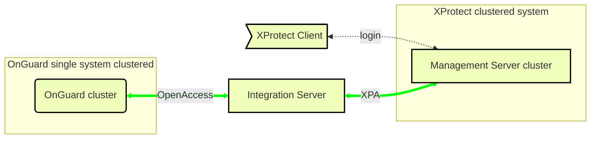

# Milestone XProtect clustered with single clustered OnGuard

When server clusters are used for redundancy, the OnGuard XProtect Access Service requires a separate Integration Server - distributed from both the XProtect and OnGuard server.  Below is the suggested architecture if both XProtect and OnGuard use server clusters:

**Clustered system design requires a separate integration server**

??? abstract "XProtect Access Clustered Configuration"
    Before configuring XProtect Access with OnGuard on a system that is using clustered XProtect Management Server Failover which includes a clustered XProtect Event Server, it is required to add all of the clustered Event Server nodes to the Registered Services within XProtect. Please refer to [KB 33314](https://supportcommunity.milestonesys.com/s/article/Clustered-Event-Server-with-XPA-integration-troubleshooting?language=en_US) for more details on using XProtect Access with clustering. Refer to [KB 34505](https://supportcommunity.milestonesys.com/s/article/setting-up-XProtect-VMS-in-Microsoft-Cluster-environment-FAQ?language=en_US) for additional information about XProtect in a clustered environment.