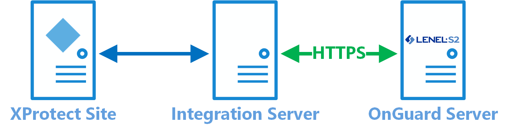
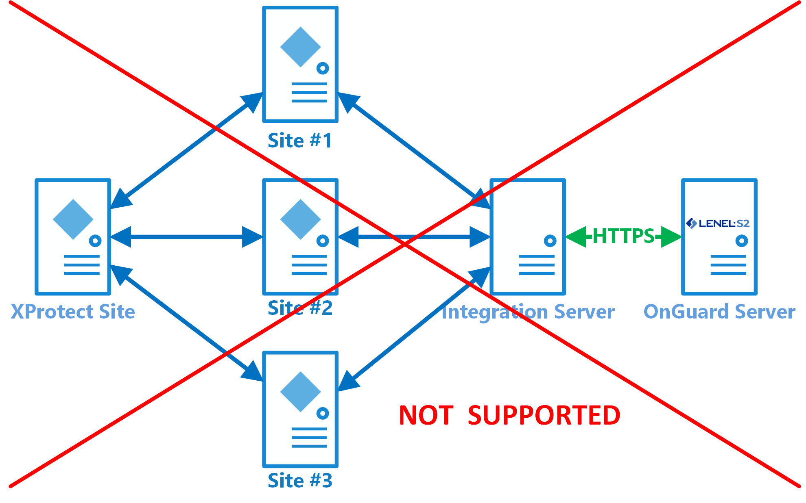

# Distributed deployment options

It's possible to have the “integration” server on a different machine than the XProtect server or the OnGuard server. This option provides segmentation of OnGuard hardware and events to individual XProtect sites, and the distributed scenario helps support OnGuard clustering.

!!! glass "Unsupported scenario"
    For design, scaling, and performance reasons, Milestone doesn't support connecting multiple XProtect sites to the same Integration Server instance.

    