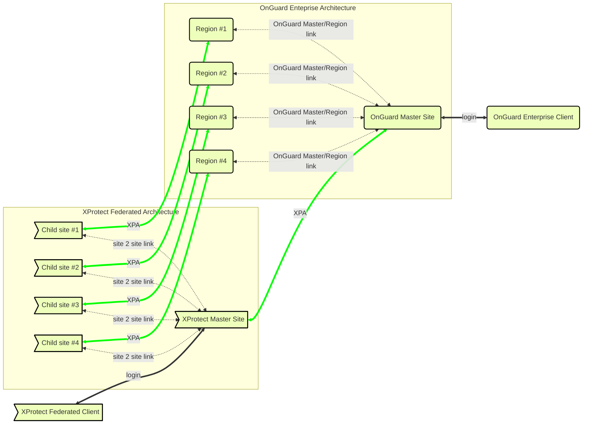

# Milestone XProtect Federated Architecture with OnGuard Enterprise

This scenario has many uses. It is recommended for large scale deployments. This is the default scenario when the customer has an Enterprise deployment of OnGuard and wants to integrate with XProtect. Also, it is recommended when the customer wants centralized alarm and configuration management for both systems.


!!! glass "Diagram Note"
    Each XPA line in these diagrams represents the HTTP/SignalR connection between the Event Server in XProtect and the OnGuard XProtect Access Service on the OnGuard server. There are some scenarios where the OnGuard XProtect Access Service may not live on the same OnGuard server, see [Distributed deployment options](/Plan/Distributed/) for details.

Milestone DOES NOT support connecting a single XProtect site to many different OnGuard regions.  We do not recommend running more than one XProtect Access integration per event server, for performance reasons.

??? warning "NOT SUPPORTED - One to Many"
    ```mermaid
    flowchart LR

        A>Single XProtect]:::XPClass <-->|XPA| B(Region 1):::XPClass
        A <-->|XPA| C(Region 2):::XPClass
        A <-->|XPA| D(Region 3):::XPClass
    
        linkStyle default stroke:#0f0,stroke-width:4px
        classDef XPClass fill:#f57, stroke:#000, stroke-width:2px
    ```

Milestone DOES NOT support connecting more than one XProtect site to a single OnGuard region.

??? warning "NOT SUPPORTED - Many to One"
    ```mermaid
    flowchart RL

        A(Single OnGuard):::XPClass <-->|XPA| B>XProtect Site 1]:::XPClass
        A <-->|XPA| C>XProtect Site 2]:::XPClass
        A <-->|XPA| D>XProtect Site 3]:::XPClass
    
        linkStyle default stroke:#0f0,stroke-width:4px
        classDef XPClass fill:#f57, stroke:#000, stroke-width:2px
    ```