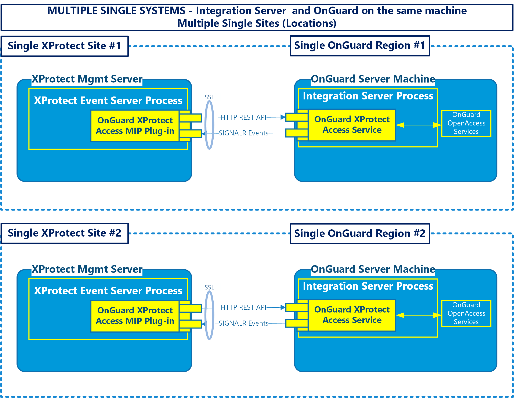

# Multiple single systems

Scaling the default scenario means adding more OnGuard systems and XProtect systems in a 1:1 ratio. The OnGuard and XProtect systems are independent of each other, keeping the OnGuard XProtect Access Service process on the OnGuard machine. The customer is NOT interested in centralized configuration or alarms, the integrated XProtect/OnGuard systems are independent of each other.

Site #1 and site #2 are independent of each other and not communicating with each other, or commonly managed.  The same is true for both the XProtect and the OnGuard systems in this scenario.