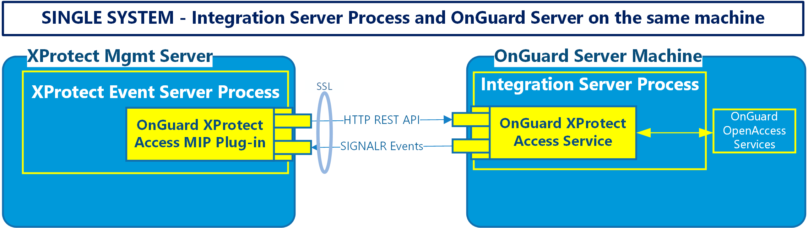

# Single system scenario

For most systems, this is the recommended installation scenario.

+ First - install the OnGuard XProtect Access Service on the OnGuard server
+ Second - install the OnGuard XProtect Access MipPlugin on the XProtect server