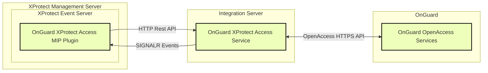

# Single system with integration server

This is the recommended system design to run the OnGuard XProtect Access Service on a different machine than the OnGuard server.

**Integration server process (OnGuard XProtect Access Service) hosted on a separate machine.**

??? warning "Encrypted communications?"
    All communication and authentication between the OnGuard XProtect Access MIP Plugin and the OnGuard XProtect Access Service can be fully encrypted and secured in both directions. Please read [Applying sercure communications between XProtect and the OnGuard XProtect Access Service](/Tech/XProtectCerts/) and [Applying secure communications between the OnGuard XProtect Access Service and OpenAccess](/Tech/OnGuardCerts/)