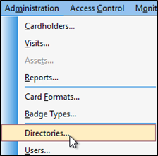
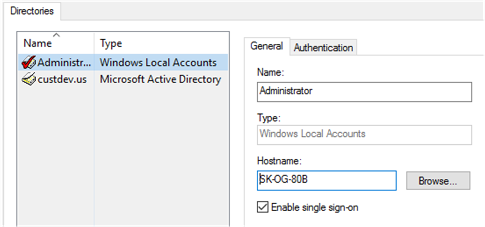
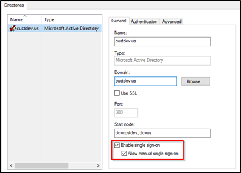

# Create directory in OnGuard

??? warning
    These instructions are not meant to replace the knowledge of a trained LenelS2 system administrator. They are here to enable the basic setup of an authentication directory and user, so the integration can connect to the OnGuard system.

!!! glass "OnGuard Enterprise"
        For an OnGuard Enterprise system, create directories from the master server.

1. Using the OnGuard System Administration app, go to the **Administration** menu and select **Directories**. 
     
     
2. Choose the directory type, either **Windows Local Account** or domain user account. 

| Windows Local Account                         | Domain user account                     |
|-----------------------------------------------|-----------------------------------------|
| For Windows Local Account support, the single sign-on account MUST be a Windows Local Account. | For Domain User Account support, the single sign-on account MUST Allow manual single sign-on as shown below. |
| { width="300" }   | { width="300" }    |

??? abstract "Other directory types"
    If you are creating a Directory of a type other than **Windows Local Accounts** (e.g. LDAP, Active Directory), verify the user is a member of the Local Administrators group.