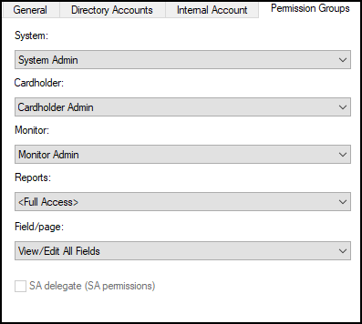

# Create user in OnGuard

??? warning
    These instructions are not meant to replace the knowledge of a trained LenelS2 system administrator. They are here to enable the basic setup of an authentication directory and user so the integration can connect to the OnGuard system.

1. Go to the Administration menu and select Users… 
    
2. Add a new user, or modify a user from the list of internal system users. 
    
3. On the **General** tab **Access to this system is disabled** should NOT be selected. 
    
4. On the **Directory Accounts** tab click **Link** to associate the user to the directory user (or local account user) from the directory created in this topic: Create directory in OnGuard. 
    
5. In the **Select Account** dialog select the directory from the Directory list. Click **Search** and select a user in **Accounts** then click **OK**. 
    
6. Once selected, the OnGuard user account is linked to the corresponding Directory account. 
    
7. On the **Internal Account** tab, make sure that the **User has internal account** option is selected. Next, enter the account credentials. 
    
8. On the **Permission Groups** tab assign the following permission groups: 
    + **System = System Admin**
    + **Cardholder = Cardholder Admin**
    + **Monitor = Monitor Admin**
    + **Reports = Full Access**
    + **Field/page = View/Edit All Fields** 
    