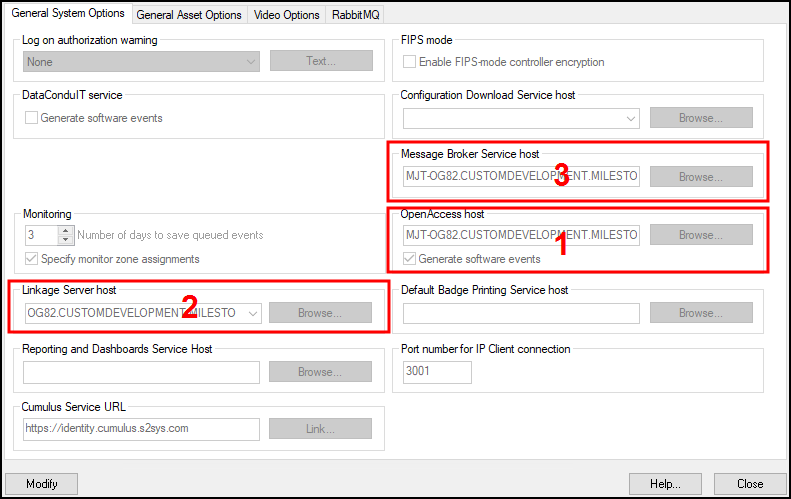

# Generate software events

In the OnGuard System Administration app, go to the **Administration** menu, and select **System Options**:

1. For OnGuard versions greater than or equal to 7.4 using OpenAccess, check the **OpenAccess host** and **Generate software events** checkbox.
2. Set the **Linkage Server host** to the OnGuard server’s machine name.
3. Set the **Message Broker Service host** to the OnGuard server’s machine name. 
    