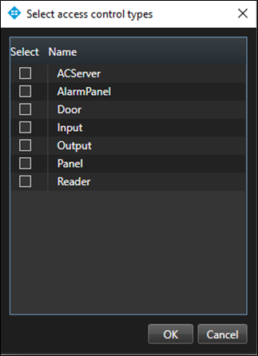
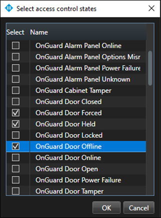
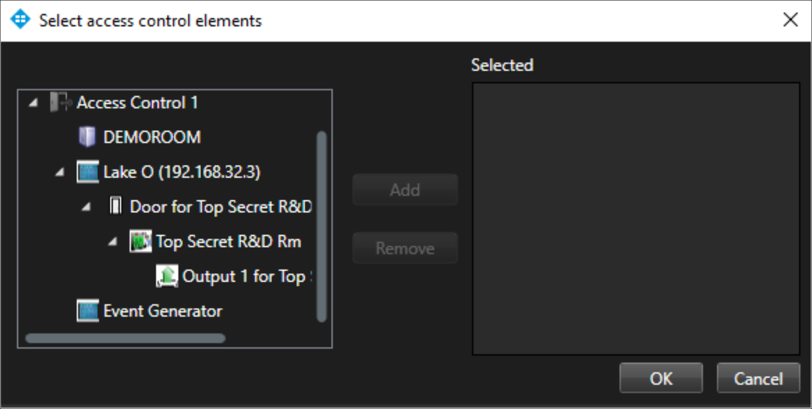
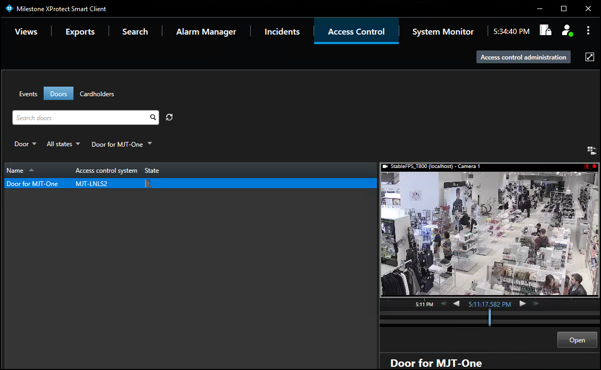

# Access control workspace doors

1. Open the **Door** list and select the access control hardware to display.
2. Choose the **Access control type…**, option to open the **Select access control types** window. 
    + **Door** is the default option for this list. Use this menu to select servers, panels, and any access control hardware in the system. 
        
3. Open the **All** states list to filter hardware by status.
4. Choose the **Access control state…**, option to open the **Select access control states** window and select from all available OnGuard hardware states. 
    
5. Open the **All doors** list and select the **Other…**, option to open the **Select access control elements** window.
    + This window provides a directory of all the OnGuard hardware in the system.
6. Expand the directory, find the hardware device(s), and add them to the selected list. 
    
7. Select a Door in the list to see video from associated cameras, view door status information, and command buttons available for that door. 
    
