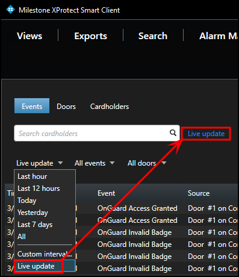
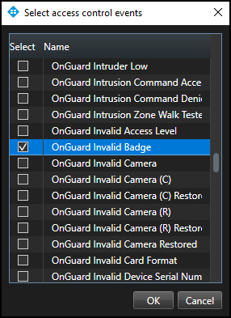
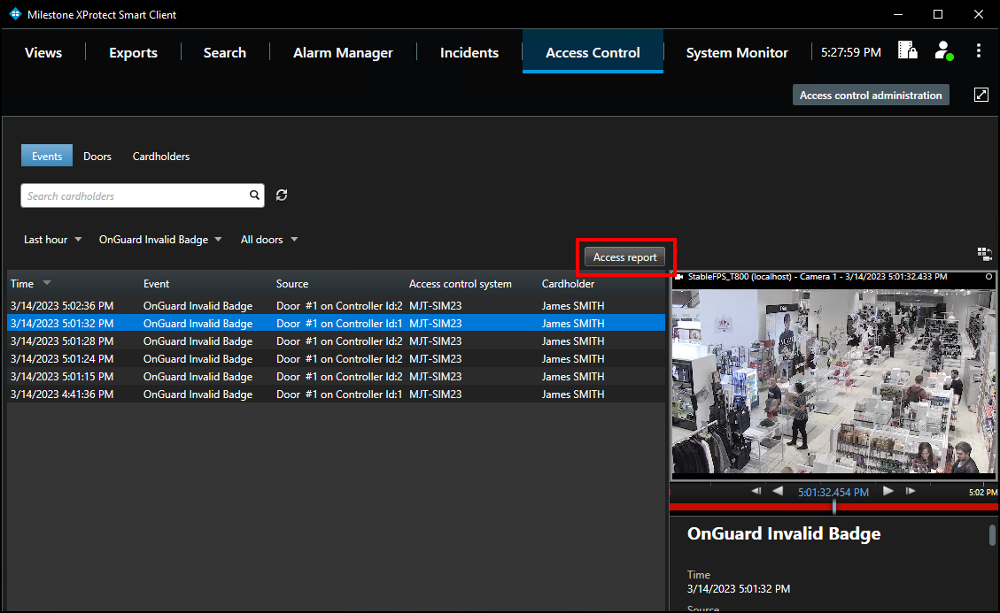
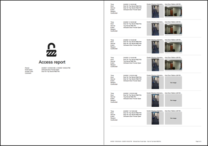

# Access control workspace events

To display a list of events, first choose a time range, select a custom time range, or choose to display a live update list of events.

1. Choose the **Live update** time range to view a real-time display of access control events. 
     
    
2. Filter for specific events including custom events and all integrated OnGuard events.
3. Open the **All** events list and select the **Access control event…** option to open the **Select access control events** window.
    + Choose a specific OnGuard event from this list. 
         
        
4. Filter for specific hardware devices.
5. Click the **Access report** button to create a PDF file of the events in the current list. 
     
    {width=75%}
    + In the **Access report window**: name the report, choose a destination to save the report, include comments, and select the option to include snapshots. 
         
        