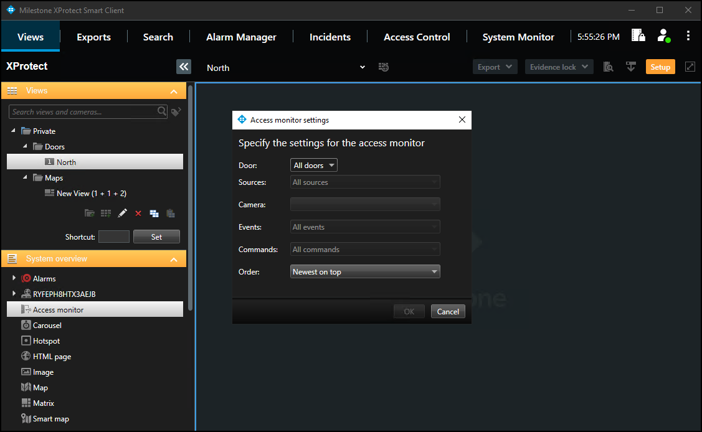
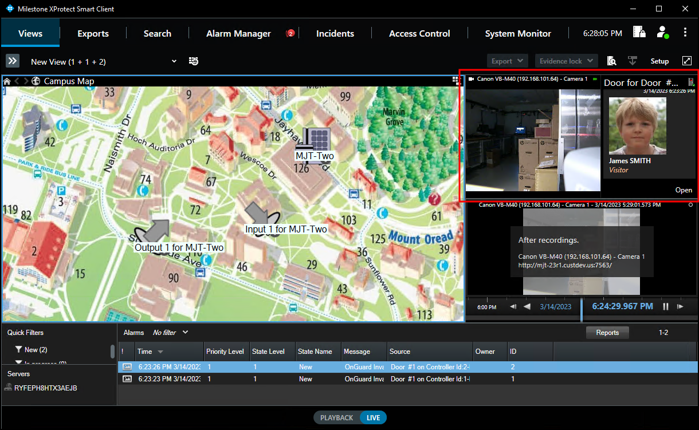

# Access Monitor

The **Access Monitor** view item displays live status from doors and video from associated cameras in a single view pane in the Smart Client.

1. Click **Setup** in the Smart Client and expand the **System Overview** panel menu. 
2. Select the **Access Monitor** view item and drag it into any available view pane: 
     
    {width=75%}
3. In the Access Monitor Settings window open the lists to select the door, sources, cameras, events, commands, and the order in which new events appear in the access monitor. 
     
    {width=75%}

!!! glass "Access Monitor options"
    After choosing a door the access monitor options change, based upon the available cameras, events, and commands. The access monitor view item can go into any available view pane and works in a view alongside all available view items.