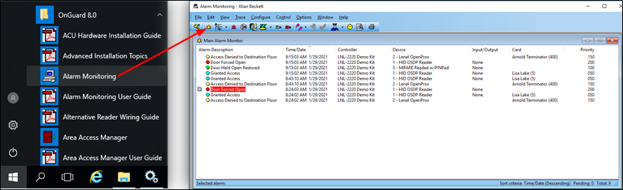

# Checking alarm acknowledgment status in OnGuard

When alarms are acknowledged in OnGuard, the alarm is closed, and the associated alarm is also closed in XProtect. If the alarm is acknowledged within XProtect it changes state to in progress both in XProtect and in OnGuard. The status of the alarm in OnGuard changes to reflect the status in XProtect as much as possible. Learn more about how the integration handles alarm acknowledgment here: [Alarm acknowledgment explained](/SCFeatures/AlarmAck/).

1. Verify state changes of alarms in the OnGuard system in real time by opening the **Alarm Monitoring** app from the **Start** menu.
2. If it isn't automatically opened, click the **View Alarms** icon to open the **Main Alarm Monitor** window.
3. Status of OnGuard alarms are displayed in this window in real time. 
     
    
4. Right click an alarm in this window to acknowledge the alarm. 

??? abstract "View Closed Alarm Reports"
    1. To view a report of all closed alarms, open the **View** menu.
    2. Select the **Reports** option.
    3. In the **Alarm Acknowledgement Reports** tab choose a time range and export a report of all acknowledged alarms in the OnGuard system. 
         
        