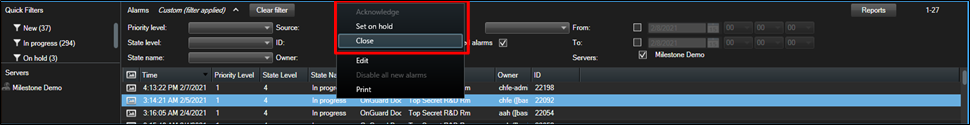

# Acknowledge alarms in XProtect

In XProtect operators perform alarm acknowledgment and other alarm status change operations from the XProtect Smart Client.

1. In the **Alarm Manager** workspace, or any alarm list view item in the Smart Client, right-click an alarm.
2. Select a new status for the alarm from the shortcut menu. 
    
3. Alarm status synchronizes as much as possible between XProtect and OnGuard.

!!! glass
    Learn more about how the integration handles alarm acknowledgment here: Alarm acknowledgment explained.