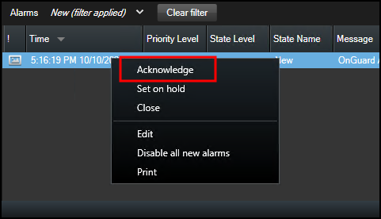
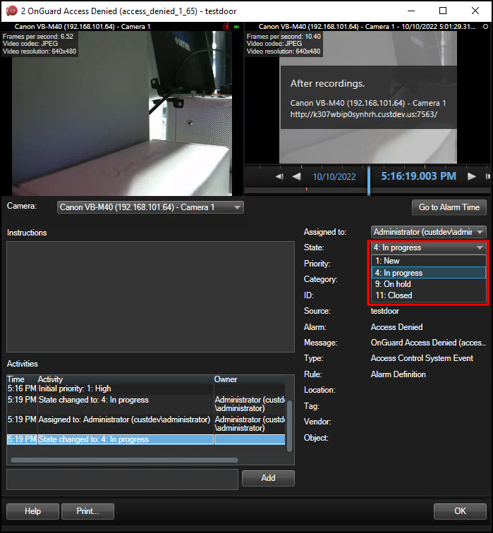

# Alarm acknowledgment explained

Alarm status between XProtect and OnGuard is shared. When alarms change state in XProtect that state is shared with OnGuard. Alarm status is shared in the opposite direction as well – from OnGuard to XProtect.

Alarm states in XProtect and OnGuard are not the same. In XProtect alarms can be new, in progress, on hold, or closed. In OnGuard alarms are new, in progress, or acknowledged.

| OnGuard Alarm Status  | XProtect Alarm Status |
|-----------------------|-----------------------|
| <ul><li>NEW</li></ul> | <ul><li>NEW</li></ul> |
| <ul><li>IN PROGRESS</li></ul> | <ul><li>IN PROGRESS</li><li>ON HOLD</li></ul> |
| <ul><li>ACKNOWLEDGED</li></ul> | <ul><li>CLOSED</li></ul> |

There are improvements to how alarms change state in the integration.

+ Acknowledging an alarm in XProtect changes the alarm state to in progress both in XProtect and in OnGuard. 
     
    
+ In XProtect alarms can change from closed to other states by manually editing the alarm. This isn't allowed in OnGuard. Acknowledged alarms are no longer available to change in OnGuard. If users continue to change the state of a closed/acknowledged alarm in XProtect these changes are not communicated to OnGuard. 
     
    
+ Alarms in XProtect can return to the new state from any other state, if the alarm is manually edited. This isn't allowed in OnGuard. If a user manually edits an alarm state to new in XProtect from any other state, that change is not made in OnGuard.
+ Although it's possible in XProtect to move a new alarm directly to on hold, this change does not take place in OnGuard, the activity is not even logged in OnGuard. If an alarm is accidentally moved to on hold in XProtect and instead it needs to move to in progress in both OnGuard and XProtect, it can be moved back to in progress, only by manually editing the status in XProtect.
+ Once an alarm is in progress in OnGuard it can be "updated" with notes, however its status in XProtect will remain in progress, until it is acknowledged/closed. Status changes made in XProtect from in progress to on hold do not impact the status in OnGuard.

??? abstract "Revert Alarm behavior to old versions"
    It's possible to change the alarm acknowledgment behavior of the integration to match previous versions (older than 4.2). How to make this change, and what this behavior means is documented here: [Changing alarm acknowledgment behavior](/SCFeatures/OldAckBehavior/).