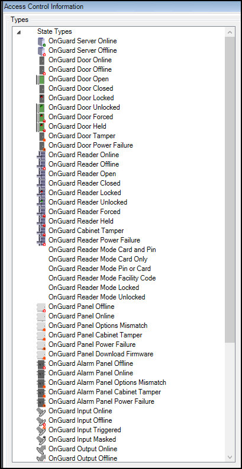

# Map icon hardware and status details

There are several different access control map icons available on the standard Smart Client map. Each different type of icon represents a specific hardware device. Visual indicators appear on these hardware icons to display the current status of the devices they represent. Many different types of hardware and status options are listed below.

The map feature of the XProtect Smart Client has many capabilities, please refer to the maps section of the [Smart Client user guide](https://doc.milestonesys.com/latest/en-US/standard_features/sf_sc/sf_configuration/sc_configuringmaps.htm?tocpath=XProtect%20Smart%20Client%7CUser%20manual%7CConfiguration%7C_____17).

??? warning "Red ring"
    Controllers send status information to XProtect Access to support display of tamper alarms on those device icons. For supported controllers, a red alarm status ring appears on the icon when it's in a tampered state. When the controller physically returns to a safe state, the alarm status disappears from the icon.

If you want to verify the list of available device icons and statuses in your XProtect Access system follow this process:

1. Go to the Tools menu in the XProtect Management Client and select **Options**.
2. On the **Access Control Settings** tab of the **Options** window choose to **Show development property panel**.
3. Close and re-open the Management Client.
4. Go to the **DEV:Category Mapping** tab of the XProtect Access instance.