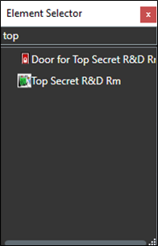
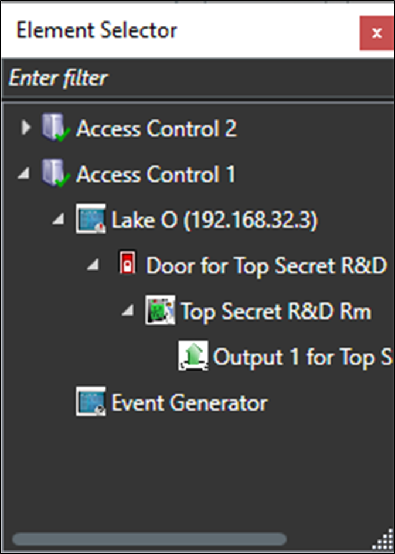
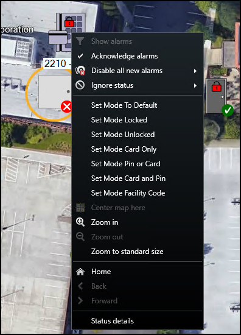
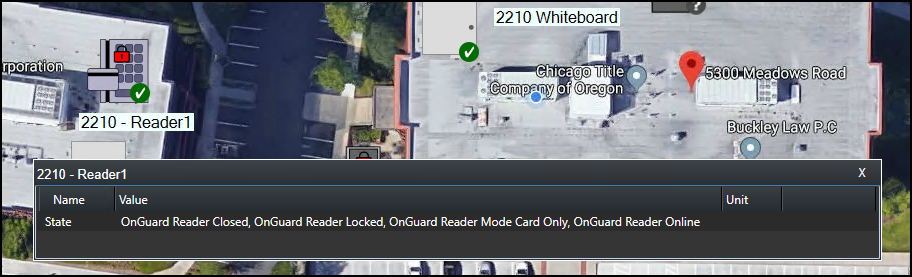

# Maps

It's possible to place doors, readers, inputs, outputs, panels, and OnGuard server(s) on an existing Smart Client map. The map icons can display hardware status and execute commands.

1. With the Smart Client in setup mode, a **Tools** window appears in the view pane.
2. From this window, select the **Add Access Control** icon: 
     
    
3. The **Element Selector** window appears. 
     
    
4. Type the name of a hardware device into the filter to find a device or expand the servers and panels to find all available hardware icons in the system. 
     
    {width=25%}
5. Drag the chosen icon onto the map.
6. During normal operations, it's possible to right-click any of these icons to execute the commands from the shortcut menu. 
     
    
7. Right click the device icon and select **Status Details** from the shortcut menu to view more information. The pop-up window displays the device status information in the **Value** field. 
     
    

!!! glass "New map icons"
    In versions 4.2 and newer of the integration, the map icons include more status options and hardware items. If you want to know the possible hardware items and status options refer to the [Map icon hardware and status details](/SCFeatures/MapIconRef/) topic.