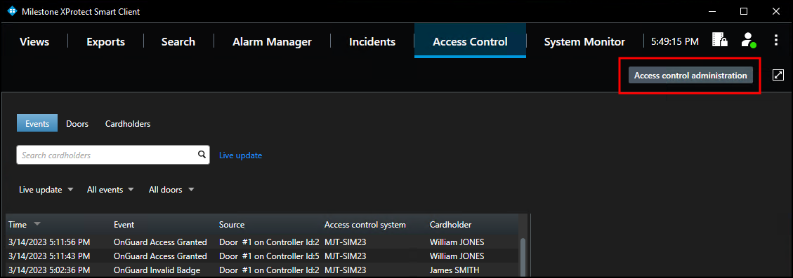
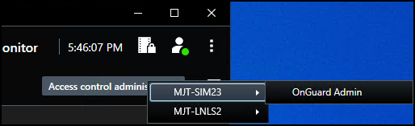
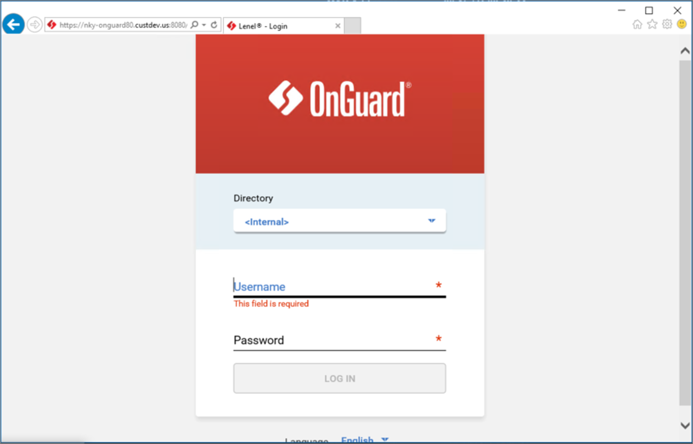

# OnGuard web admin link

If a web portal link was added to the **General Settings** of the XProtect Access OnGuard integration within the XProtect Management Client, then the **Access control administration** link in the **Access Control** workspace of the XProtect Smart Client is active. 

{width=75%}

1. Click the **Access control administration** link to view the OnGuard Admin button. 
     
    
2. Select the **OnGuard Admin** button to launch the OnGuard web administration portal. 
     
    {width=75%}

!!! glass "Multiple OnGuard Systems"
    If multiple XProtect Access systems integrate with the same XProtect VMS it's possible to have more than one button in the Smart Client after selecting the **Access control administration** link.