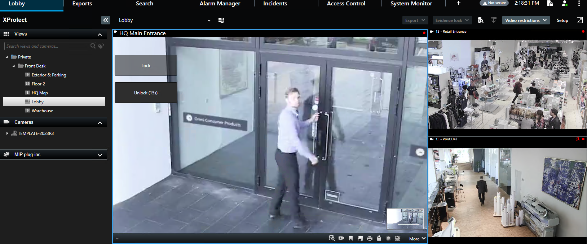
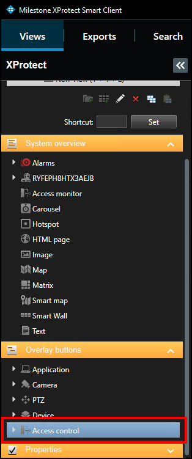
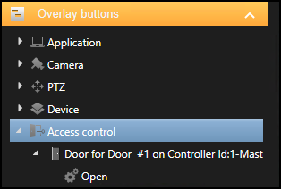
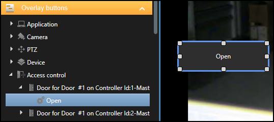
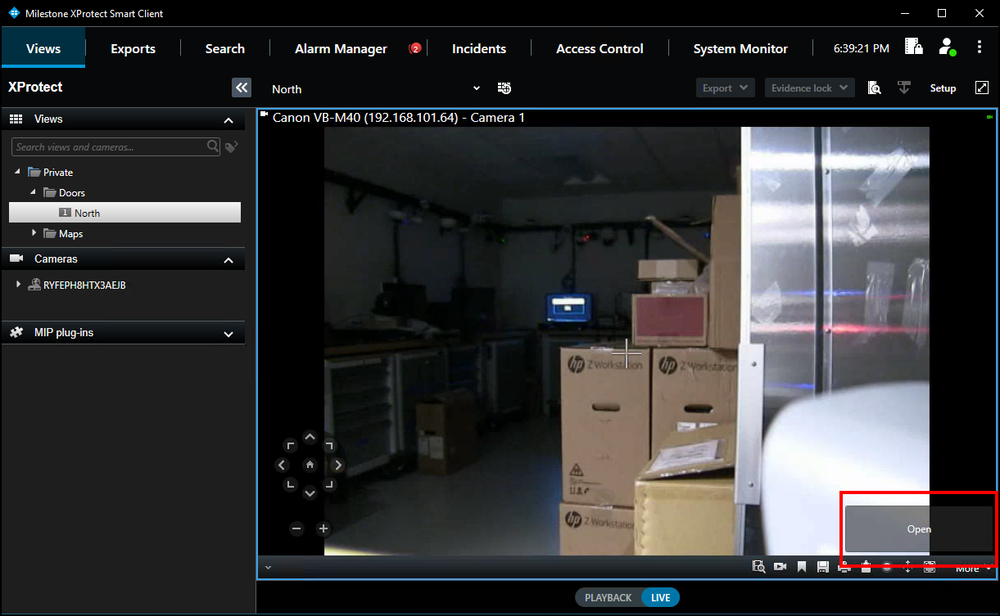

# Overlay buttons & commands

Overlay buttons are used to add manual buttons to video panes. Anything that can be triggered by a command can be added with an overlay button in the Smart Client. Read more about how overlay buttons work in XProtect [here](https://doc.milestonesys.com/latest/en-US/standard_features/sf_sc/sf_configuration/sc_configuringcamerasettings.htm#Overlaybuttonsexplained).

Overlay buttons appear as a layer on top of the live video when you move your mouse over the individual view pane. Use overlay buttons to activate device functionality, trigger system events, trigger low-voltage outputs, start recording…etc.  This functionality is extended into the XPA integrations. There are a large number of possible uses for these buttons. 

??? glass "Why use overlay buttons and commands?"
    The most common use case for overlay buttons and XPA integrations is to allow experienced video operators the ability to add door lock and unlock functionality to the familiar Smart Client views they use everyday. The ability to add door control (lock/unlock functionality) to live views is a great way to increase the overall functionality of the entire system, and makes the integration between access control and video feel much more seamless from an operational perspective.

    > 
    
    In particular, if customers want to visually verify access requests on highly secure doors, overlay buttons allow anyone who can view live video, to also have the ability to open the doors. 

    Other use cases can include any functionality connected to the door panel via programmable input and output connections, which can include the following:

    >
    >   - Control lights or heating/cooling systems.
    >   - Arm/disarm connected intrusion alarms and other sensors.
    >
    ***

**Follow this process to add an overlay button to a view:**

1. When the Smart Client is in setup mode, there is an **Overlay Buttons** panel on the left side of the client.
2. Select the **Access Control** icon. 
     
    
3. Expand the **Access Control** icon to find all the doors and readers, panels, and the connected inputs and outputs in the system. 
     
    
4. Select a command from the list and drag it onto the view pane. 
     
    
5. The output commands include activate and deactivate. Once the button is visible on a camera view pane, and the Smart Client is in setup mode, it is possible to re-size, move, and rename the overlay button. 
     
    {width=75%}