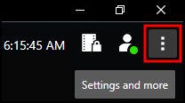
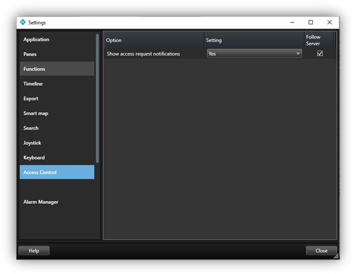

# Smart Client access control options

1. In the upper right corner of the Smart Client is the **Settings and more** menu. 
    
    + Click this icon and choose the **Settings** option to enter the Smart Client **Settings** window.
2. Select the **Access Control** menu in the **Settings** window. 
    
3. Choose to show or block access request notifications in the Smart Client.