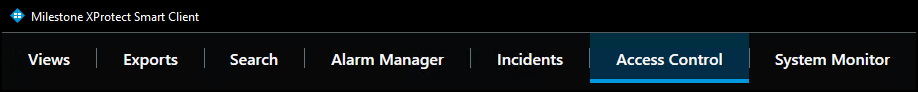

---
hide:
  - toc
---
# Access control workspace explained

The XProtect Access OnGuard integration adds a new workspace, or tab, into the XProtect Smart Client. The **Access Control** workspace should appear in the Smart Client.

Use this workspace to search and filter the **Events**, **Doors**, and **Cardholders** categories. Select **Events**, **Doors**, or **Cardholders** to work with the list of events related to that category.