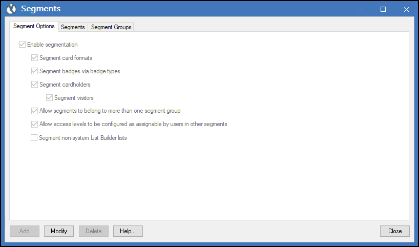
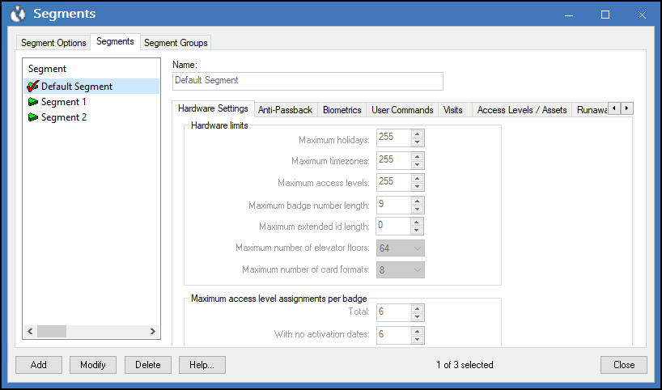

# Configuring segments within OnGuard

??? warning
    The following process shows where the information about existing segments is found within an OnGuard system. Please consult with your LenelS2 representative before adding segments to an operational OnGuard system.

1. Go to the **Segments** sub-menu in the **Administration** menu of the OnGuard System Administration application.
2. The **Segment Options** tab contains options to enable segmentation.
     
    {width=60%} 
3. The **Segments** tab contains the segments configured within OnGuard.
     
    {width=60%}