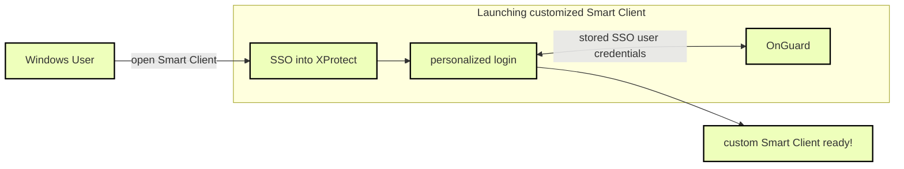

# XProtect Access and SSO authentication (explained)

XProtect single sign-on (SSO) doesn't delegate SSO to the OnGuard system. XProtect SSO uses the logged in Windows user, and it can't automatically present that same user to OnGuard for authentication. The personalized login feature of XProtect Access is how XProtect presents unique credentials for authentication with OnGuard.

These personalized login credentials can match a user with SSO in OnGuard. They can even be the same user logged into Windows who is launching the Smart Client. The credentials must be entered at the first login of the Smart Client, and re-entered if the credentials are changed in OnGuard. Then a user can log into Windows, launch the Smart Client, which automatically authenticates with XProtect via SSO. At this point the stored credentials for the personalized login user that matches the XProtect user are presented to OnGuard and the OnGuard user's configuration is loaded into the Smart Client. This can all be done without manually presenting any credentials to XProtect or OnGuard.

This is the closest to a true SSO user experience that the XProtect Access integration offers. It requires using the personalized login feature. If this feature isn't used, all authentication to OnGuard from XProtect Access uses the same user credentials that the OnGuard XProtect Access Service uses to refresh and fetch the configuration from OnGuard. To use this partial SSO user experience with customized privileges, it's important to link XProtect users and roles directly to the appropriate SSO users within OnGuard.