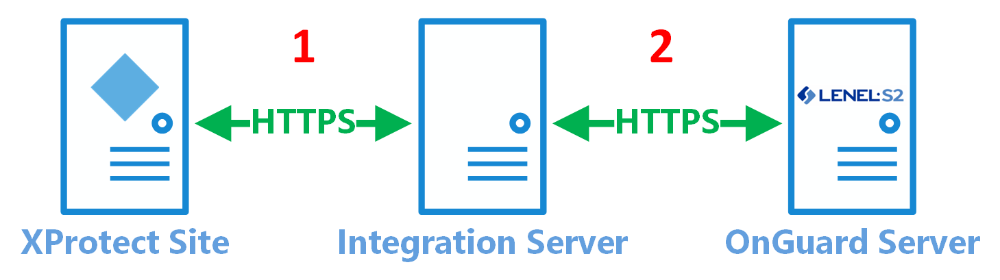

---
hide:
  - navigation
---
# Secure communication explained

XProtect Access integrations can be  configured  to use encrypted communications. The XProtect Access integration with OnGuard can encrypt communications between the XProtect Access service and the XProtect Event Server, and between the XProtect Access service and OpenAccess service. 

??? Abstract "Certificate Types"
    >
    >   Please note: the instructions in this document are for generating self-signed certificates. It's possible to get certificates from a trusted third-party provider. For more information please read the [XProtect VMS certificates guide](https://doc.milestonesys.com/latest/en-US/portal/htm/chapter-page-certificates-guide.htm).
    >
***

The process of securing communications between OnGuard and XProtect should start after the integration has been installed and configured. There are two different processes required.

1. Certificate generation, distribution, and configuration supporting secure communications between XProtect and the OnGuard XProtect Access Service.
2. Certificate extraction, distribution, and configuration supporting secure communications between OpenAccess and the OnGuard XProtect Access Service. This process (#2) is required when the OnGuard XProtect Access Service isn't installed on the OpenAccess host machine. 
