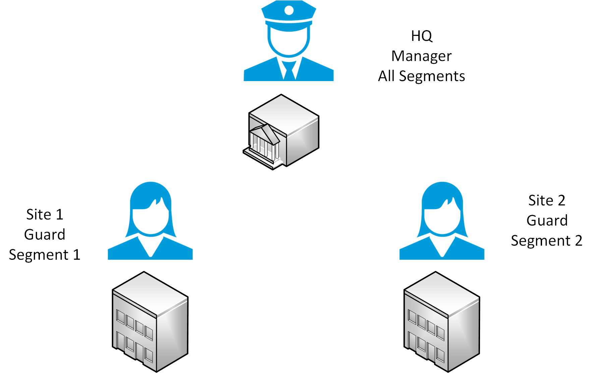
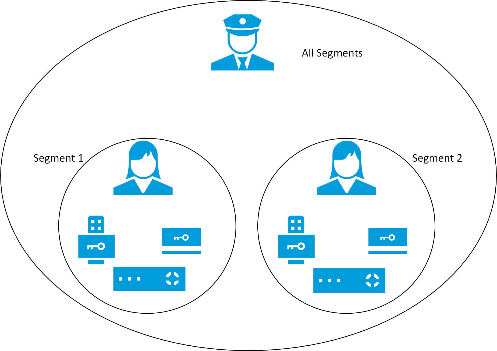

# OnGuard segments explained

Personalized login can control which devices, events, and alarms users can view in the Smart Client when integrated with segmented OnGuard systems. A segmented OnGuard system uses logical groupings, known as segments, to define which access panels, readers, cardholders, and users work together.

??? warning "Warning"
    Creating a segmented system within OnGuard shouldn't be a part of installing the XProtect Access OnGuard integration. It's recommended to consult with an authorized OnGuard representative before configuring segments.

For example, an organization with facilities in many locations can use segments within their OnGuard system so users have access to view and manage the devices at the facilities relevant to their job.

Illustrated below is an organization with three sites, a head quarters, site 1, and site 2.

{width=50%}

Using segments, the guard user at site 1 can see readers, panels, and cardholders from segment 1, and the guard user from site 2 can see the devices and information from segment 2. The manager can see all devices and information, since they're in the default "All Segments" segment.

{width=50%}