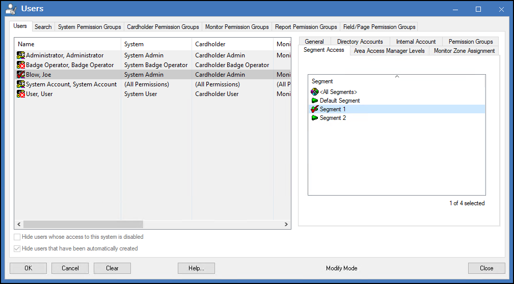
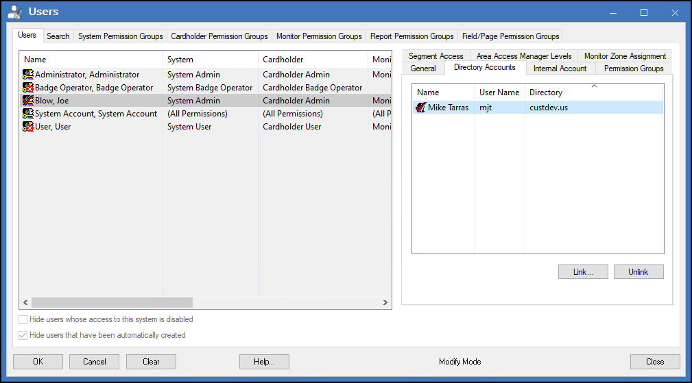

# Mapping OnGuard users to segments

1. Go to the **Users** sub-menu in the **Administration** menu of the OnGuard System Administration application.
2. Click **Modify**.
3. Select the **Segment Access** sub-tab.
4. In the **Segment** listing window, select the segment(s) the user has access to.
     
    {width=75%} 
5. Click **OK** to save the changes.

??? abstract "Mapping domain users"
    It's recommended to map users logically from your domain, to XProtect, to OnGuard and to their segment. This lets SSO in XProtect work with the personalized log-in feature, and with segments within OnGuard, to simplify the log-in experience, while also customizing and controlling the integrated Smart Client.

    You can map OnGuard users to a domain user within XProtect in the **Directory Accounts** sub-tab of the Users sub-menu of the **Administration** menu in the OnGuard System Administration application.

    {width=75%}

