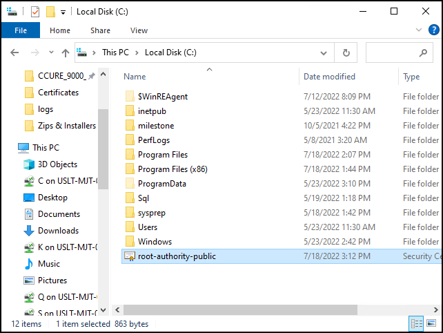
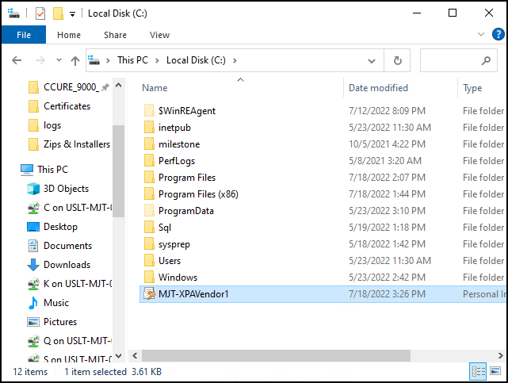
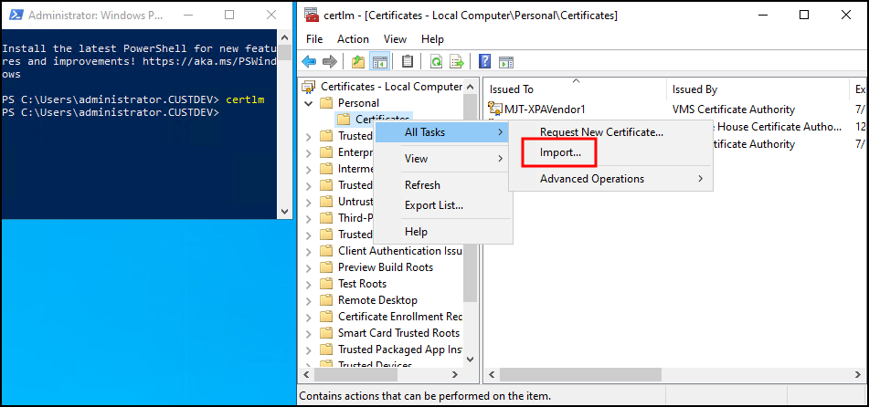
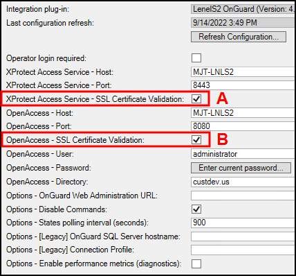

# Applying secure communications between XProtect and the OnGuard XProtect Access Service

In versions 4.2 and higher of the XProtect Access OnGuard integration, there is a tool built into the XProtect Access service to help users manage certificates. This process shows the steps required to generate, distribute, and configure the solution to secure communications between XProtect and the OnGuard XProtect Access Service.

??? abstract "Certificate Types"
    The process included below is for self-signed certificates. If you are using a third party certificate, from a commercial certificate provider, please skip ahead to step number ten below. Refer to the [XProtect Certificate Guide](https://doc.milestonesys.com/latest/en-US/portal/htm/chapter-page-certificates-guide.htm) for any questions on dealing with certificates.

1. On a server with restricted access, open PowerShell as an administrator and run the script in Appendix A, to create a CA certificate. 
     
     
2. By default the script places the new root certificate in the C:\ file location. Move the certificate to the XProtect server.
3. On the XProtect server right-click the certificate and select **Install Certificate** to begin the certificate installation wizard.
4. Choose to place the certificate in the **Store Location** of the **Local Machine**.
5. Browse and import the certificate in to the **Trusted Root Certification Authorities** folder.
6. Complete the wizard.
7. Go back to the server with restricted access where you generated the root certificate, open PowerShell and enter the script in Appendix B, to generate a new client certificate to install on the server hosting the OnGuard XProtect Access Service.
8. The script requires input: the DNS name of the server hosting the OnGuard XProtect Access Service, the IP address of the server, and a certificate password of your own choosing - enter this information and complete the script.
9. By default the script generates the certificate at the C:\ file location. Copy the file and move it to the server hosting the OnGuard XProtect Access Service. 
     
     
10. Go to the server hosting the OnGuard XProtect Access Service and run the certificates snap-in for the local machine. Right-click the **Certificate** store within the **Personal** folder and choose to **Import** a new certificate. 
     
    {width=75%} 
11. Import the certificate into the store of the local machine. Choose the certificate file that you copied to the local server. Enter the password chosen during the script. Browse to the personal folder of the certificate store to choose that as the location for the certificate. Complete the import wizard.
12. Open the OnGuard XProtect Access Service service tray icon and choose the certificate to use. It should match the hostname of the OnGuard server. The service restarts once the configuration is saved.
13. Now apply encryption for the OnGuard XProtect Access instance in the XProtect Management Client. There are three options to use for secured communication for the integration. This process enables use of **XProtect Access  Service - SSL Certificate Validation**, option A below. 
     
    