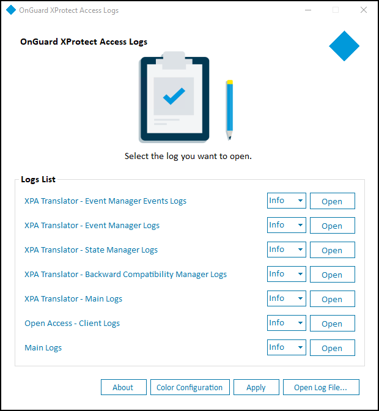
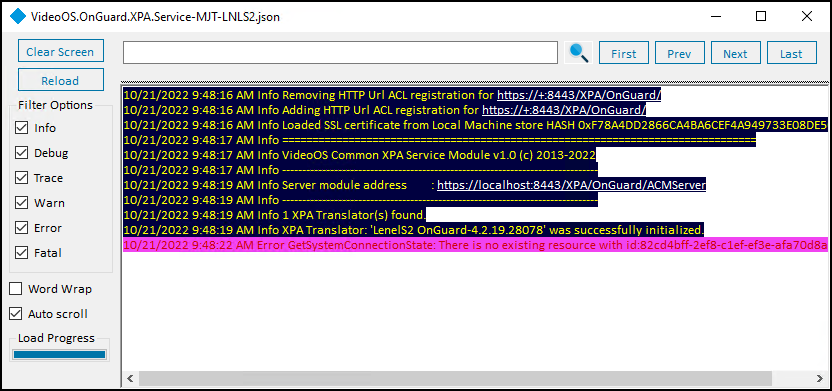
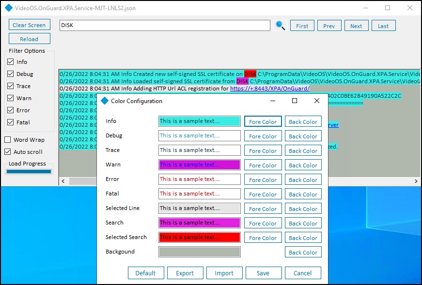

# Using the log viewer application

??? warning "After integration upgrades"
    When upgrading the integration, all log levels configured in a non-default level of detail (not Info) are reset to "Info" after the upgrade. Please confirm and reconfigure the log level to the desired setting after the upgrade is complete.

1. Choose the **View logs** option from the shortcut menu of the service tray icon to launch the log viewer.</br>
    </br>
    
2. All available log files are in the **Logs List**. Adjust the detail level of the log using the list to the left of the **Open** button. Once you have chosen the level of detail click the **Apply** button to change the log level. The success dialog window pops up when the change is applied.</br>

    !!! glass "Log level explained"
        The available log levels are **Trace**, **Debug**, **Info** (default), **Warn**, **Error**, and **Fatal**. Trace shows the highest level of detail, Fatal shows the least amount of detail.

3. Click the **Open** button to launch a new window used to search through the individual log file.</br>
    </br>
    
    + Type in the text field at the top of the menu and hit enter or click the magnifying glass icon to start a text search. Use the **First**, **Prev**, **Next**, and **Last** buttons in the top right to navigate the search results.
    + The **Clear Screen** button empties the main text display window, and the **Reload** button resets the current log file after a search. If the log file is large and takes time to load, the **Load Progress** graph at the bottom left displays the status of the load operation.
    + Use the **Filter Options** menu to choose which types of log messages to display.
    + The **Word Wrap** and **Auto scroll** options control the appearance and real-time behavior of the main text display window.
4. Click the **Open Log File...** button to launch a file explorer menu set to the local log file location.</br>
    
    !!! glass "Log location"
        The default location of the log files is ```C:\ProgramData\VideoOS\VideoOS.OnGuard.XPA.Service\logs```

5. Click the **About** button for version information and online access to Milestone support resources.
6. Click the **Color Configuration** button to open the **Color Configuration** menu to create a custom color scheme for the log reader. Custom color schemes are saved, exported, and imported with this menu. The Default button removes any customized configurations and applies the default settings.</br>
    </br>
    