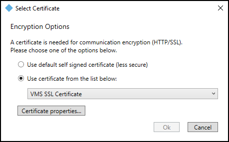

# Using the Select Certificate menu

1. From the server hosting the OnGuard XProtect Access Service right-click the service tray icon for the OnGuard XProtect Access Service and choose the **Select Certificate...** option.
2. This opens the **Select Certificate** dialog. Initially, the **Use default self signed certificate** option is selected. 
     
    
3. The option is also available to choose any other certificate. Choose the **Use certificate from the list below** option to select any certificate from the local machine's personal certificate store. 
    
    ??? warning "Empty certificate list"
        If there are no certificates available in the list, please refer to Secure communications explained and read about creating compatible certificates.

4. The **Certificate properties...** button launches a properties menu for the chosen certificate.