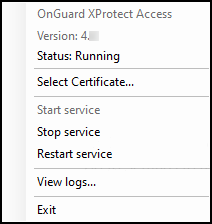

---
hide:
  - navigation
---
# Service tray icon (explained)

The OnGuard XProtect Access Service, that runs on the OnGuard server has a service tray icon with a shortcut menu used for viewing status of the service, managing certificates, launching the log viewer, and starting and stopping the service. Right-click the OnGuard XProtect Access Service service tray icon to view the shortcut menu.

